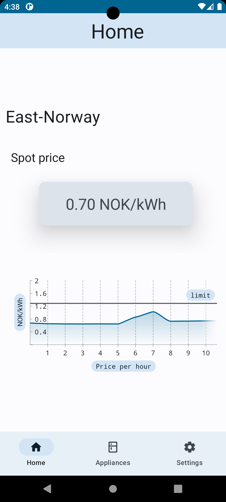
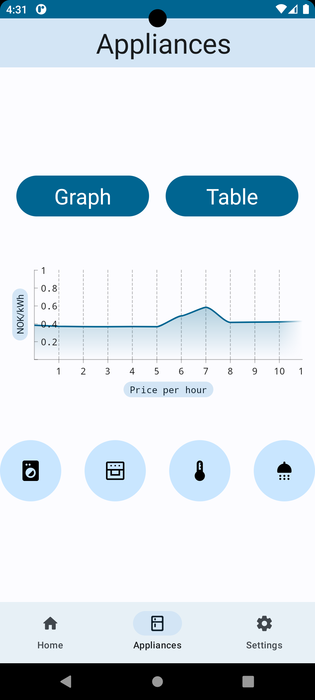
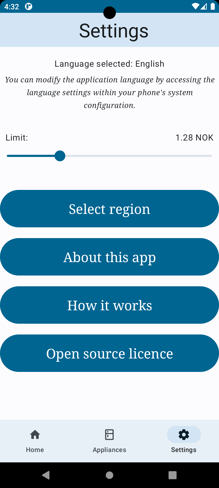

# PricePulse

An app that shows you the current electricity price, today's price per hour and what different appliances would cost to operate.

## Purpose
PricePulse shows the user the current electricity price and today's price per hour. It also calculates what it would cost to use different appliances for a given time.

With its easy-to-use interface, users can indiscriminatory, see today's electricity price per hour and also what different appliances would cost to use in different parts of the day.

Currently the app only calculates the price of usage to washing machine, oven, heater and shower.

Our app is optimized for both phone and tablet use. In addition to that, you can easily change the language to either Norwegian or English.
        
We hope you enjoy using our electricity price calculator app and that it helps you stay informed and prepared.

## Screenshots

## Attributaion
This app has been developed in collaboration with the Norwegian Meteorological Institute and as part of an exam assignment for IN2000 at the University of Oslo.

The project was undertaken by:
- Kashmala Hafeez Sheikh
- Osman Nasib Ali Ahmed
- Sakaria A. Ahmed
- Sofia Ibn El Moujdi Troger
- Suleyman Boyar
- Adam Hussainy